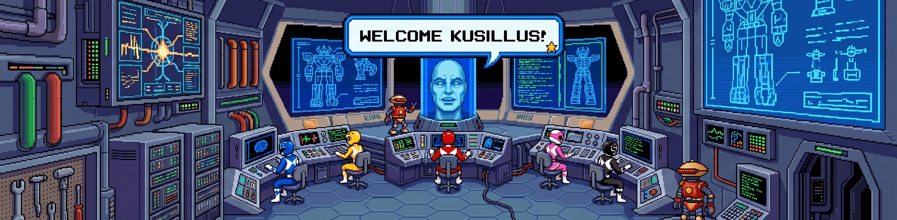
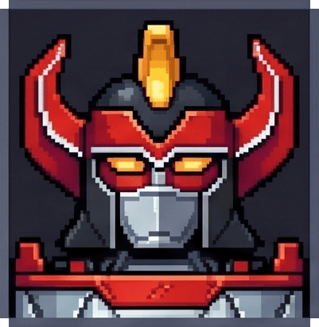
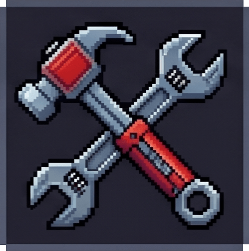
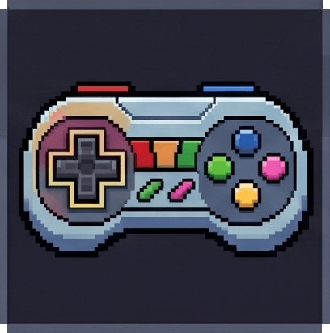
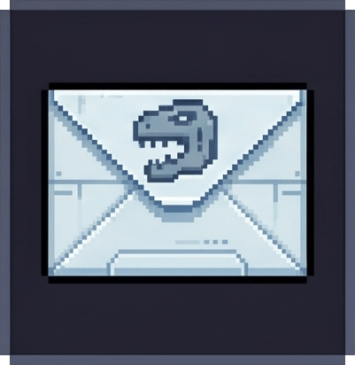

<!-- Banner / Header -->
<div align="center">
  
</div>

# ¡Hola! Soy Alexander Guevara (kusillus) 👋
### Backend Developer & Product Tech Lead | AI & Fintech Builder | Pokémon VGC Competitor ⚡

Apasionado por la intersección entre la ingeniería de software y la estrategia de negocio. Me especializo en el diseño de APIs robustas y escalables, la dirección técnica de plataformas fintech en el sector financiero y la automatización inteligente utilizando modelos avanzados de IA en entornos reales de desarrollo.


<!-- Social icons -->
<div align="center">
  <a href="https://github.com/Kusillus">
    
  </a>
  <a href="https://www.tiktok.com/@kusillus">
    
  </a>
  <a href="https://linkedin.com/in/kusillus">
    
  </a>
</div>
---

<!-- Social icons -->
<div align="center">
  <a href="https://github.com/Kusillus">
    
  </a>
  <a href="https://www.tiktok.com/@kusillus">
    
  </a>
  <a href="https://linkedin.com/in/kusillus">
    
  </a>
</div>


###  Sobre mí

* **Liderazgo de Producto y Software:** Como **Product Tech Lead / Product Owner** en **Recadia**, **Prestamype** y **Cambioseguro**, conecto los objetivos de negocio con soluciones tecnológicas de alto impacto para optimizar pasarelas de pago y sistemas financieros.
* **Backend & Arquitectura de Software:** Experiencia sólida diseñando microservicios y APIs estructuradas con **Node.js (Koa / Express)** y bases de datos NoSQL (**MongoDB / Mongoose**), priorizando el rendimiento, la escalabilidad y la seguridad.
* **Automatización y Ecosistema de IA:** Integro modelos avanzados de lenguaje (**Claude API, AWS Bedrock, Ollama, Gemini**) mediante flujos automatizados (*MCP servers*) para optimizar el ciclo de desarrollo y auditoría de código.
* **Desarrollo Multiplataforma:** Experiencia coordinando e implementando soluciones frontend modernas con **Nuxt 3 / Vue 3** y aplicaciones móviles con **Flutter** bajo principios de *Clean Architecture* y gestión de estado con *BLoC*.
* **Sistemas y Entornos:** Defensor del ecosistema Open Source; configuro y mantengo mis entornos de trabajo sobre arquitecturas **Arch Linux** y **CachyOS** optimizados para el desarrollo diario de software.

---

###  Ecosistema Técnico y Herramientas

| Capa / Categoría | Tecnologías Clave |
| :--- | :--- |
| **Backend & APIs** | Node.js · Koa · Express · TypeScript · JavaScript |
| **Bases de Datos** | MongoDB · Mongoose · AWS DocumentDB |
| **Frontend Web** | Nuxt 3 · Vue 3 · TailwindCSS |
| **Mobile Dev** | Flutter · Dart · Clean Architecture · BLoC |
| **Infraestructura & DevOps** | AWS (Bedrock, WAF, CDK, CodePipeline) · Docker · LocalStack |
| **IA & Productividad** | Claude Code · Gemini CLI · Ollama · MCP Servers · Obsidian |
| **Ecosistema OS** | CachyOS Linux · Arch Linux · PipeWire audio server |

---

###  Fuera del Código

* ⚡ **Pokémon VGC:** Jugador competitivo en circuitos oficiales y estratega/mánager del equipo *"Los Conejos"*. Uso herramientas analíticas especializadas para la optimización de composiciones.
* 🖨️ **Impresión 3D:** Entusiasta de la fabricación digital y diseño. Opero tecnologías FDM (**Ender 3 V2**) y Resina (**LD-002H**), gestionando un pequeño proyecto personal enfocado en componentes customizados (incluyendo Beyblade X).
* 🎸 **Guitarra Eléctrica:** Dedico tiempo de aprendizaje interpretando con una **Epiphone Slash Edition**, utilizando herramientas como Rocksmith adaptadas de forma nativa en entornos Linux.
* 🏋️ **Gimnasio y Enfoque:** El entrenamiento de fuerza y el gimnasio son pilares esenciales en mi día a día; la disciplina requerida bajo la barra es la misma que aplico al resolver problemas de software complejos.
* 🎬 **Creación de Contenido:** Comparto mi experiencia dev, configuraciones y vida en el mundo de la tecnología a través de TikTok.
* 🐈 **Feline Co-workers:** Vivo y comparto mi espacio de trabajo diario junto a mis 3 gatos, quienes actúan como revisores finales de cada despliegue.

---

###  Conectemos

Siempre estoy interesado en expandir mi red, compartir experiencias técnicas en fintech, debatir sobre arquitecturas de IA o intercambiar ideas de estrategia competitiva.

* 🌐 **Sitio Web:** [kusillus.com](https://kusillus.com)
* 💼 **LinkedIn:** [linkedin.com/in/kusillus](https://linkedin.com/in/kusillus)
* ✉️ **Email:** [wguevarab7@gmail.com](mailto:wguevarab7@gmail.com)

```javascript
const profile = {
  developer: "Alexander Guevara",
  handle: "kusillus",
  mission: "Building secure, intelligent, and scalable fintech ecosystems",
  origin: "Peru 🇵🇪",
  status: "Available to connect"
};

```